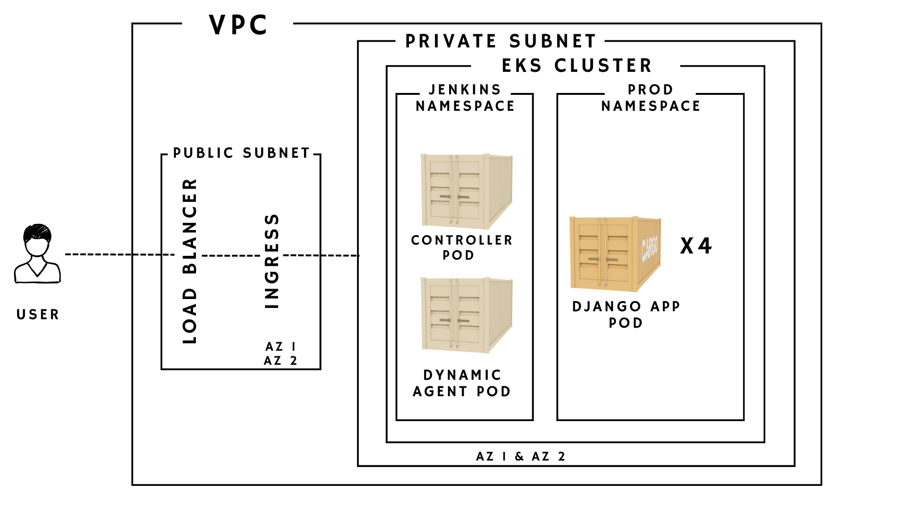

# aws-multi-az-eks-jenkins-cicd-pipeline

# Arcthitecture 

Cloud-native CI/CD pipeline on AWS EKS leveraging Jenkins (controller + dynamic agents), Docker, and Kubernetes for automated build, scan, and multi-AZ zero-downtime deployments with ALB ingress.
