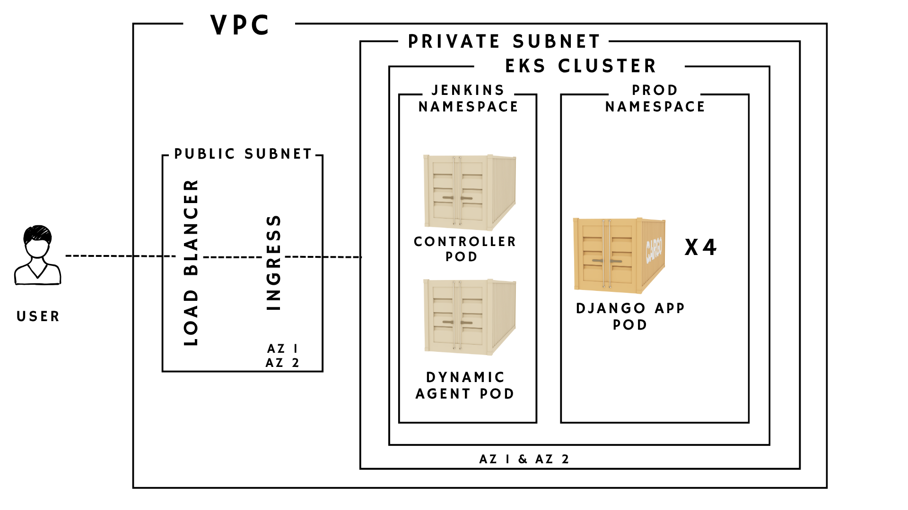

# AWS EKS CI/CD Pipeline with Jenkins & Kubernetes (Multi-AZ)

1. Deployed multiple replicas of a Django application across multiple AZs using EKS.  
2. Updated production deployments using dynamic Jenkins agents.  
3. Provisioned complete infrastructure using Terraform.  

# Prerequisites
 1. Docker 
 2. Python 3 
 3. Django 
 4. AWS account

# Arcthitecture 

### Infrastructure

- 1 VPC  
- 1 Public Subnet → Ingress  
- 2 Private Subnets → EKS Nodes & Application Pods  

### Request Flow

User → Internet Gateway → Service → Application Pods

Cloud-native CI/CD pipeline on AWS EKS leveraging Jenkins (controller + dynamic agents), Docker, and Kubernetes for automated build, scan, and multi-AZ zero-downtime deployments with ALB ingress.

## 🛠️ Tech Stack

- AWS  
- EKS  
- ECR  
- Terraform  
- Jenkins  
- Python  
- Django

---

## 📋 Prerequisites

- AWS Account  
- IAM User with access to:
  - EKS  
  - Node Groups  
  - ECR  
  - VPC  
  - Load Balancer  

- Python 3  
- Django (latest)  
- Terraform CLI  
- AWS CLI  
- Docker  
- IDE (VS Code recommended)  

## Step to download and setup environment 

## ⚙️ Getting Started

### 1. Create / Login to AWS
Login to your AWS account.

---

### 2. Create IAM User

Create a user `Sub_admin` with permissions for:
- EKS
- ECR
- Node Groups
- VPC
- Load Balancer

---

### 3. Clone Repository

bash
git clone <your-repo-url>
cd <repo-name>

---

### 4. Configure AWS Credentials 

aws configure

aws configure set aws_access_key_id "YOUR_ACCESS_KEY"
aws configure set aws_secret_access_key "YOUR_SECRET_KEY"
aws configure set default.region "us-east-1"
aws configure set default.output "json"

### 5. Provision Infrastructure (Terraform)

cd infra/terraform

terraform init
terraform validate
terraform plan
terraform apply

### 6. Configure EKS Access

aws eks update-kubeconfig --region <your-region> --name <your-cluster-name> 

### 7. Deploy Jenkins

cd k8s/jenkins

kubectl apply -f namespace.yaml
kubectl apply -f rbac.yaml
kubectl apply -f jenkins_controller.yaml
kubectl apply -f service.yaml

### 8. Access Jenkins

http://\<public-ip\>:\<nodeport\>

### 9. Create Jenkins Pipeline

Configure pipeline job
Add webhook trigger from GitHub
Configure stages:
  Build
  Scan
  Push to ECR
  Deploy to EKS

### 10. Access Application

http://\<ALB-DNS or Public IP\>
